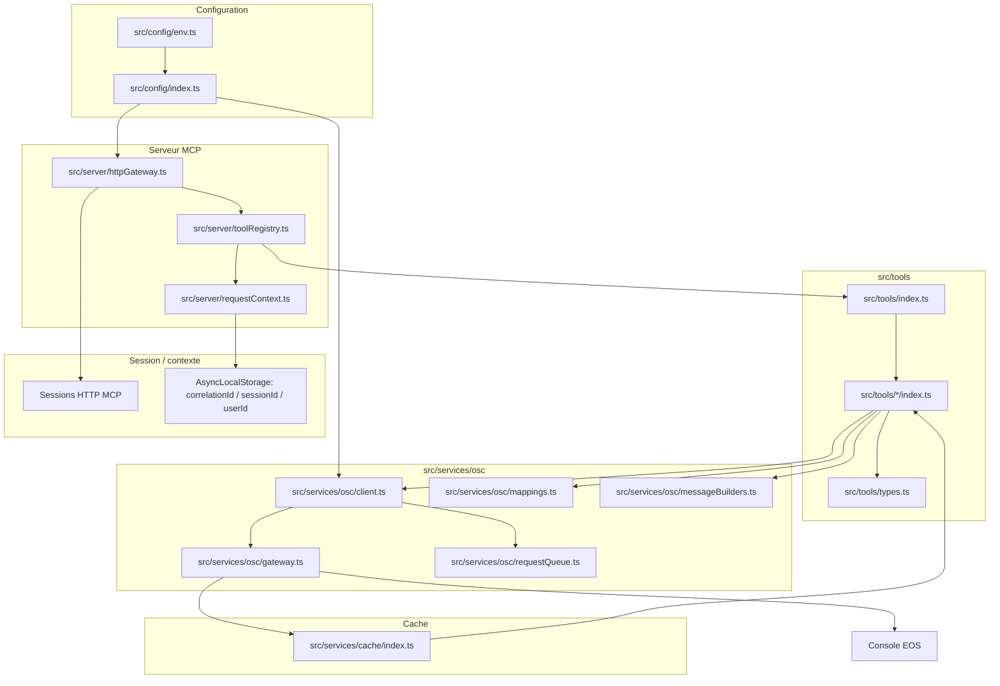

# Architecture Eos MCP

Ce document donne une vue d'ensemble du trajet d'un appel MCP jusqu'à la console ETC Eos. Il sert de point d'entrée aux contributeurs qui veulent ajouter un outil, modifier une adresse OSC ou comprendre les points d'extension du serveur.

## Flux principal

Le flux nominal part d'un client MCP ou d'un assistant LLM, traverse la passerelle HTTP optionnelle, puis le registre d'outils. Les handlers situés dans `src/tools/*` valident et normalisent leurs arguments, construisent les commandes ou requêtes OSC attendues, et délèguent l'envoi au client OSC partagé avant réception de la réponse de la console.

```mermaid
flowchart LR
  client[Client MCP / LLM]
  gateway[src/server/httpGateway.ts]
  registry[src/server/toolRegistry.ts]
  tools[src/tools/*]
  oscClient[src/services/osc/client.ts]
  eos[Console EOS]

  client -->|JSON-RPC / MCP| gateway
  gateway -->|Streamable HTTP transport| registry
  registry -->|invoke handler| tools
  tools -->|commande ou requête OSC| oscClient
  oscClient -->|OSC UDP / TCP| eos
  eos -->|réponse OSC| oscClient
  oscClient -->|résultat normalisé| tools
  tools -->|ToolExecutionResult| registry
  registry --> gateway
  gateway --> client
```



> Le transport stdio utilise le même registre et les mêmes définitions d'outils. `src/server/httpGateway.ts` ajoute surtout les endpoints HTTP (`/mcp`, `/health`, `/tools`, `/schemas/tools/*`, `/manifest.json`), la gestion de sessions MCP et les contrôles de sécurité HTTP.

## Diagramme des composants



### Rôles principaux

- **Configuration** : `src/config/env.ts` charge `.env`; `src/config/index.ts` valide et normalise les ports OSC, l'adresse locale/distante, les options HTTP, la sécurité et le logging.
- **Passerelle HTTP** : `src/server/httpGateway.ts` expose les routes MCP et d'observabilité, applique les middlewares de sécurité, crée les sessions `StreamableHTTPServerTransport` et rattache un serveur MCP à chaque session HTTP.
- **Registry** : `src/server/toolRegistry.ts` enregistre les `ToolDefinition`, compose les middlewares, encapsule chaque exécution dans un audit et injecte le contexte de requête.
- **Outils** : `src/tools/index.ts` agrège les familles d'outils; chaque module `src/tools/*` déclare un `inputSchema` Zod, un handler et, si nécessaire, des middlewares métier.
- **Couche OSC** : `src/services/osc/client.ts` centralise handshake, ping, commandes, requêtes JSON, timeouts, file d'attente et corrélation; `src/services/osc/mappings.ts` porte les adresses OSC canoniques; `messageBuilders.ts` construit et valide certains contrats de messages.
- **Cache** : `src/services/cache/index.ts` mémorise les ressources lues depuis la console avec TTL, tags et invalidation par adresse ou préfixe OSC. Le client OSC branche les messages entrants sur ce cache via le gateway partagé.
- **Session / contexte** : `src/server/httpGateway.ts` conserve les sessions MCP HTTP; `src/server/requestContext.ts` expose `correlationId`, `sessionId` et `userId` aux couches inférieures via `AsyncLocalStorage`.

## Cycle de vie d'un appel outil

1. **Réception MCP**  
   Le client envoie une requête JSON-RPC MCP. En HTTP, `src/server/httpGateway.ts` route les appels vers `/mcp`, vérifie ou crée une session MCP, puis délègue au transport `StreamableHTTPServerTransport`.

2. **Résolution dans le registry**  
   Le serveur MCP appelle le callback enregistré par `ToolRegistry.register()`. Le registre normalise `(args, extra)`, retrouve le handler, compose les middlewares éventuels et prépare l'audit.

3. **Validation Zod**  
   Chaque outil déclare son schéma dans `config.inputSchema`. Ce schéma est transmis au SDK MCP au moment de l'enregistrement et les handlers qui ont besoin d'une normalisation stricte reparsent aussi leurs arguments avec `z.object(...).strict()` ou un schéma équivalent. Les workflows peuvent accepter des métadonnées additionnelles quand leur schéma est explicitement conçu pour cela.

4. **Contexte et audit**  
   `ToolRegistry.executeWithAudit()` déduit `correlationId`, `sessionId`, `userId`, mode de sécurité et compatibilité EOS. Il exécute ensuite le handler dans `runWithRequestContext()`, ce qui permet au client OSC d'ajouter le `correlationId` aux options d'envoi.

5. **Exécution du handler**  
   Le handler métier convertit les arguments validés en intention Eos : commande texte (`Chan 1 At Full`, `Record Cue 1 / 12`, etc.), requête JSON, sélection de palette, patch, workflow multi-étapes, lecture de session, etc.

6. **Construction OSC**  
   L'outil s'appuie sur `src/services/osc/mappings.ts` pour les adresses et sur `src/services/osc/messageBuilders.ts` ou des helpers locaux pour construire les arguments OSC (`s`, `i`, payload JSON sérialisé). Les messages construits peuvent être validés par contrat avant envoi.

7. **Envoi et attente de réponse**  
   `src/services/osc/client.ts` envoie via le gateway OSC. Les opérations passent par `RequestQueue` pour contrôler la concurrence et les timeouts. Pour les appels avec réponse, `createResponseAwaiter()` écoute les messages entrants, matche l'adresse de réponse attendue, puis résout avec le payload ou renvoie un statut `timeout` / `error` normalisé.

### Garanties de concurrence OSC

`src/services/osc/requestQueue.ts` applique la concurrence configurée par cible OSC. Une cible est définie par le triplet `targetAddress` / `targetPort` / `transportPreference`; deux consoles ou deux préférences de transport différentes disposent donc de files indépendantes. Les tâches d'une même cible restent FIFO quand la concurrence effective vaut `1`, et les timeouts ou erreurs d'une tâche libèrent la file sans bloquer les suivantes.

`src/services/osc/client.ts` ajoute des verrous par famille pour les actions qui touchent un état partagé EOS :

- `command-line` : `/eos/cmd`, `/eos/newcmd` et `/eos/get/cmd_line` restent exclusifs par cible, car ils modifient ou lisent la ligne de commande partagée de la console.
- `session-control` : handshake, sélection de protocole et souscription restent exclusifs par cible pendant la négociation de session ou d'abonnement.
- `show-control` : reset reste exclusif par cible.

Les requêtes JSON documentées, les pings et les messages OSC génériques sans famille sensible peuvent être parallélisés jusqu'à `requestConcurrency` pour une même cible. Ils restent néanmoins isolés des autres cibles par leur file propre et continuent d'utiliser leurs options de routage (`targetAddress`, `targetPort`, `transportPreference`) lors de l'envoi gateway.

Les diagnostics de queue sont exposés par `OscClient.getQueueDiagnostics()` et inclus dans `OscClient.getDiagnostics().queue` quand le gateway fournit déjà des diagnostics. Ils indiquent `pending`, `activeCount`, la `concurrency` configurée et le détail par cible (`targetKey`, longueur pending, tâches actives et familles verrouillées).

8. **Cache et invalidations**  
   Les lectures de ressources peuvent passer par `getResourceCache().fetch()` avec TTL et tags. Les messages OSC entrants sont aussi transmis au cache pour invalider ou actualiser les entrées concernées.

9. **Format `ToolExecutionResult`**  
   Le handler retourne toujours un objet compatible avec `ToolExecutionResult` :

   ```ts
   {
     content: [{ type: 'text', text: 'Message lisible par l’opérateur' }],
     structuredContent: {
       status: 'ok',
       // données métier, commandes envoyées, payloads OSC, diagnostics, etc.
     }
   }
   ```

   `content` sert à la réponse conversationnelle MCP. `structuredContent` porte les données stables pour les intégrations, tests, workflows et contrôles post-action.

10. **Réponse MCP**  
    Le registry journalise le résultat ou l'erreur, puis rend le `ToolExecutionResult` au serveur MCP. La passerelle HTTP ou stdio le renvoie au client.

## Où modifier quoi

| Besoin contributeur | Fichier principal | À vérifier |
| --- | --- | --- |
| Ajouter, retirer ou réordonner un outil exposé au serveur MCP | `src/tools/index.ts` | Importer la famille d'outils, l'ajouter à `definitions`, puis exécuter les tests de naming et la génération de docs. |
| Créer une nouvelle famille d'outils | `src/tools/<famille>/index.ts` puis `src/tools/index.ts` | Déclarer `inputSchema` Zod, `ToolDefinition`, handler, résultat structuré et tests `__tests__`. |
| Modifier une adresse OSC ou une famille d'endpoints Eos | `src/services/osc/mappings.ts` | Mettre à jour les builders, tests de payload OSC et docs si l'adresse devient visible aux utilisateurs. |
| Changer la logique d'envoi, les timeouts, la corrélation, le handshake ou la gestion des réponses | `src/services/osc/client.ts` | Valider `requestQueue`, `createResponseAwaiter()`, diagnostics, cache listener et tests OSC. |
| Ajouter ou modifier un builder de message OSC typé | `src/services/osc/messageBuilders.ts` | Définir le contrat attendu, valider les arguments et couvrir la sérialisation JSON. |
| Ajuster cache/TTL/invalidation pour les ressources lues | `src/services/cache/index.ts` | Choisir `resourceType`, clés stables, tags d'adresse OSC et tests de cache. |
| Modifier la documentation générée des outils | `scripts/toolDocs.ts` | Exécuter `npm run docs:generate` pour régénérer `docs/tools.md` ou `npm run docs:check` en CI. |
| Changer sécurité HTTP, sessions, manifest, healthcheck ou schémas JSON exposés | `src/server/httpGateway.ts` | Vérifier token/API key/IP allowlist, sessions MCP, `/health`, `/tools`, `/schemas/tools/*` et tests HTTP. |

## Checklist rapide avant PR

- Ajouter ou adapter les tests unitaires de la famille modifiée.
- Lancer `npm run docs:check` si les schémas ou descriptions d'outils changent; lancer `npm run docs:generate` si la référence doit être régénérée.
- Lancer au minimum `npm run tsc` et le ou les tests ciblés.
- Vérifier que les actions sensibles gardent le pattern **plan → dry-run → confirmation → exécution** quand elles modifient le show.
